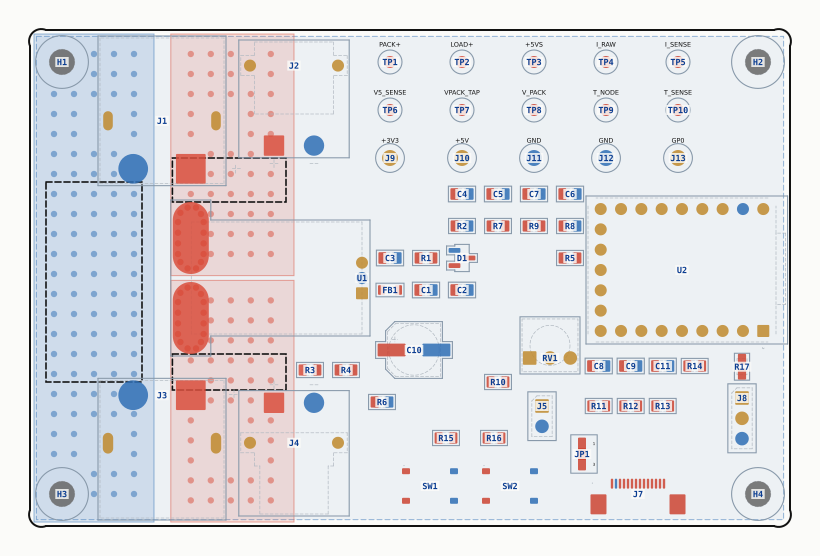

# RC Logging Current Meter

A 150 A / 60 V inline power meter and datalogger for RC ESC test benches, a WM150-class
meter with live logging, a graphing touchscreen, and thermistor plus ESC-signal channels.

**Status: Rev A. Schematic and layout complete, fabrication package generated, boards on
order.** Firmware not yet written.



---

## What it does

| Parameter | Value |
|---|---|
| Max voltage | 60 V DC (14S LiPo) |
| Max current | **150 A burst**, ~60 A continuous, limited by the XT60 rather than the sensor |
| Current sensor | ACS770KCB-150U, Hall, galvanically isolated, 100 µΩ conductor |
| MCU | Waveshare RP2040-Zero |
| Display | 3.5" 480×320 IPS, ST7796U + FT6336U touch + microSD, 14-way FPC |
| Logging | microSD **and** USB CDC at 100 Hz |
| Channels | current, pack voltage, 5 V rail, 1× 100 k NTC, plus ESC signal out |
| Board | 95 × 62 mm, 4 layer, 1 oz outer / 0.5 oz inner |
| Parts cost | ≈ $15/board, of which the ACS770 alone is $9.98 |

**Read the accuracy budget in [`DESIGN.md`](DESIGN.md) §5 before trusting a number.** Short
version: honest between roughly 30 A and 150 A, and increasingly meaningless below ~20 A,
because a ±1%-of-full-scale nonlinearity term is a fixed ±1.5 A regardless of reading. That
is inherent to putting a 150 A Hall sensor on a small current. For *comparative* testing,
same board, same session, ESC A vs ESC B, the systematic terms cancel and repeatability is
far better than the absolute figures.

## Two ideas worth sharing

**The ratiometric trick (§4.2).** The sensor's output scales with its own supply, which here
is raw USB VBUS, sagging with cable resistance and modulated by the display backlight PWM.
Rather than fight that with a regulator, a second divider measures the 5 V rail, and the
current is recovered from the *ratio*. Both V_CC and V_REF cancel algebraically, so accuracy
depends only on two resistor ratios and the sensor's own spec.

**The current path crosses the short dimension.** The ACS770's terminals sit side by side,
so rotating it 90° and stacking the connectors above and below gives a ~28 mm connector-to-
connector path. The ground return, not the sensor, turns out to dominate the loss budget.
See §8.

---

## Repository layout

```
Logging_Current_Meter.kicad_sch    schematic
Logging_Current_Meter.kicad_pcb    board, 95 × 62 mm, 4 layer
LCM.kicad_sym / LCM.pretty         all project symbols and footprints, self-contained
production/                        gerbers, BOM, positions and IPC netlist as sent to fab
DESIGN.md                          the real documentation, reasoning, maths, decisions
BOM.md / BOM.csv                   bill of materials, generated from the schematic
generator/                         the Python that builds and checks all of the above
```

`DESIGN.md` is the substantive document; this README is only an index. It records *why*
each choice was made, including the ones that turned out wrong and were reversed.

---

## The generator / verifier toolchain

The schematic and board are hand-edited in KiCad, but every mechanical change is applied by
script and checked by an independent verifier. The rule throughout: **the checker re-reads
the finished file from disk and re-derives everything, so it can disagree with the tool that
wrote it.**

```bash
cd generator

# check, read-only, safe at any time
python3 verify.py     ../Logging_Current_Meter.kicad_sch ../LCM.kicad_sym
python3 verify_pcb.py ../Logging_Current_Meter.kicad_pcb ../Logging_Current_Meter.kicad_sch

# regenerate derived artefacts
python3 gen_bom.py                                    # BOM.md + BOM.csv from the schematic
python3 copper_budget.py ../Logging_Current_Meter.kicad_pcb   # 150 A loss budget
python3 region_map.py    ../Logging_Current_Meter.kicad_pcb   # the §14 layout map
python3 render_pcb.py    ../Logging_Current_Meter.kicad_pcb ../placement.svg
```

`verify.py` rebuilds the netlist **geometrically**, so pins, wire endpoints and label anchors
sharing a coordinate are one node, then compares it against an independently written
expectation of all nets and pin connections. `verify_pcb.py` runs nine checks over the
board: s-expression syntax, footprint inventory against the schematic, net coverage, board
extent, courtyard overlaps, stale net names, pour and stitching integrity, components inside
soldermask openings, and pad-to-pad clearance against the resolved netclass rules.

Both currently pass clean.

> **`gen_pcb.py` will refuse to run its `place` or `pour` stages once the board has routed
> tracks**, because both would destroy hand routing. Override with `--force` only after
> re-syncing the placement table from the board.

Every check in `verify_pcb.py` exists because something actually went wrong: a quoted
s-expression tag that made KiCad reject the file, a net rename that left a dead name on a
live pad, a resistor placed inside a soldermask aperture, a netclass clearance that made a
0.5 mm-pitch connector unroutable. The commentary in the source explains each one.

---

## Known open items

- **RV1 footprint.** Corrected from the wrong 3362 variant (pads in a row) to the real
  3362P triangle, verified against the vendor EasyEDA model. **Not yet applied to the
  board.** Running *Update Footprints from Library* moves all three pads 1.27 mm and
  requires re-routing `T_NODE` and `T_POT_TOP`. See `DESIGN.md` §4.4.
- **D1 / U1 courtyards overlap by 3.49 × 0.45 mm.** Checked: courtyard margin only, no pad,
  body or silk inside it. KiCad will still flag it.
- **Two KiCad 10 format assumptions**, inner copper layer ordinals and zone/via nets
  written by name, are documented in `DESIGN.md` §14. Both are load-bearing and neither is
  confirmed against a KiCad-written example.
- **Firmware.** Architecture is sketched in `DESIGN.md` §11; nothing is written. The known
  risk to test first is whether the display module's microSD tri-states MISO cleanly. R13
  is a 0 Ω placeholder in that path for exactly this reason.

## Sourcing note

The ACS770 is marked *not for new designs* but remains in stock. **ACS772KCB-150U-PFF-T is
a drop-in replacement requiring no board changes at all**, same package, same 26.66 mV/A,
same quiescent output, same ratiometric behaviour, same load limits. `DESIGN.md` §4.1.1 has
the full comparison, including which of the commonly-quoted differences are wrong.

## Licence

- **Hardware** (schematic, PCB, footprints, symbols, BOM, documentation):
  [CC BY-NC-SA 4.0](LICENSE), plus the additional permissions below.
- **Software** (the Python in `generator/`):
  [PolyForm Noncommercial 1.0.0](generator/LICENSE), plus the same additional permissions.

### What you can do

Build one. Build several. Modify the design. Use it at work, in a business, in a makerspace,
in a classroom, or in a paid repair shop. Put it in a monetised YouTube video, a paid course,
or a magazine article. Publish your modified version, as long as you credit this project and
licence your version the same way.

### What you cannot do

Sell the design files. Sell hardware built from them, whether assembled boards, bare PCBs, or
kits. Bundle either into a product you sell. Selling kits is how this project funds itself,
so that part is reserved.

Want to sell something based on this? Ask. Contact **team@justcuzrobotics.com**.

### Why it is written this way

CC BY-NC-SA's "NonCommercial" clause is broader than the intent above; read strictly it would
also block using one at work or in a monetised video. The additional permissions in the
LICENSE files grant those uses explicitly, so the only real restriction is on selling the
design or hardware.

Because commercial sale is restricted, this is source-available rather than open source in
the OSI or OSHWA sense.

Copyright © 2026 Seth Schaffer / Just 'Cuz Robotics
